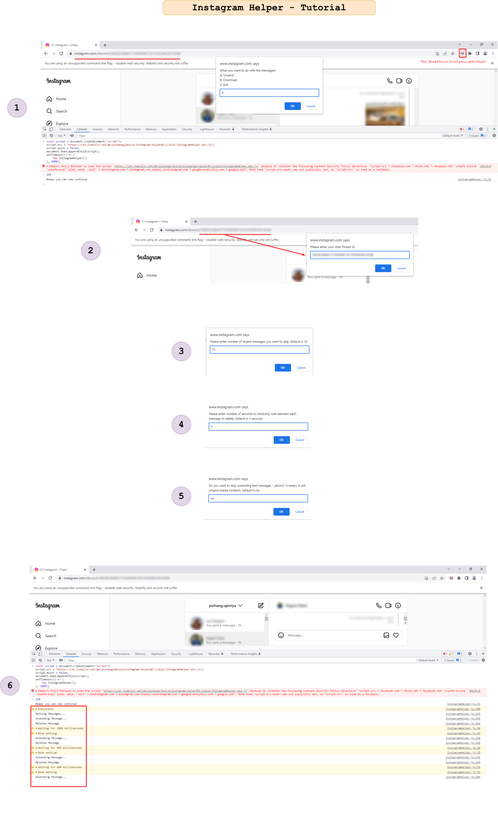
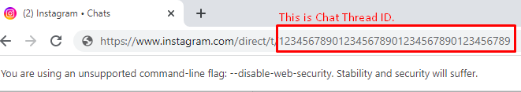

## 🌎 [Instagram Helper](https://pishangujeniya.github.io/instagram-helper/)

<h2 style="color: red;"> THIS DOES NOT WORK NOW, AS INSTAGRAM UPDATED THIER SITE IN MAY, 2023 </h2>
<p> We are trying to fix it, but it may take couple more weeks. Press Watch & star at the above to keep yourself updated </p>

# Instagram Helper Script
> Instagram Scripts for various tasks automation


This JavaScript has helper methods to perform various tasks automation.

### How to use?



- Install [Chrome Browser](https://www.google.com/intl/en_in/chrome/)
- Create an empty temporary folder somewhere.
- Download the file [InstagramHelperChrome.vbs](./InstagramHelperChrome.vbs) and double click on it.
- Select that temporary created folder.
- That will then generate a Chrome Shortcut on your selected path with name `InstagramHelperChrome`
- Open that Special Chrome Browser using that shortcut. (Ignore the flag that says _You are using an unsupported comman-line flag: --disable-web-security. Stability and security will suffer_) (This flag is shown because we will be mimicking the automation process of Sending Request to Instagram using Chrome).
- Install [**Disable Content-Security-Policy**](https://chrome.google.com/webstore/detail/disable-content-security/ieelmcmcagommplceebfedjlakkhpden?hl=en) Extension.
- Open [Instagram.com](https://instagram.com) in new tab and click on CSP icon to enable them. *(It should turn pink)*
- Press `F12` (Developer Tools) or `Ctrl+Shift+I`
- Press `Ctrl+R` to reload the page.
- Paste the following code in the console tab.

```javascript

const script = document.createElement("script");
script.src = "https://cdn.jsdelivr.net/gh/pishangujeniya/instagram-helper@3.1/dist/InstagramHelper.min.js";
script.async = false;
document.head.appendChild(script);
setTimeout(() => {
    new InstagramHelper();
}, 2000);


```

### Prompts

|Input Message| Corresponding Meaning |
|--|--|
| Please enter your chat Thread ID. | Your chat thread ID.  |
| Please enter number of recent messages you want to skip. Default is `10`. | The number of your recently sent messages which will be skipped and will not be deleted. If you do not enter any number then it will take by default 10 |
| Please enter number of seconds to randomly wait between each message to delete. Default is `3` seconds | Number of seconds to randomly wait between unsending each message, so that Instagram server do not think that the actions are automated. |
| Do you want to skip unsending text messages - `yes`/`no`? It means it will unsend media contents. Default is `no`. | If you provide `yes` then it will not unsend the text messages, and  starts unsending other type of messages such as *media*,*photos*, *videos* which you have sent. |


### ⁉ FAQ

#### 😖 Getting errors displayed in console while running the code
- There might be some errors related to Instagram site, not every error displayed on console are from our script.
- If error persists and repeats everytime, then close browser logout and relogin and then try running the code.

#### 😵 Getting too often "Try again tomorrow" Error or 429 Response Code?
- Try to close the browser re-open Instagram and logout then login.
- Try with more higher number of delay seconds.

#### ⏳ Why unsending is slow?
- Deleting messages is kept intentionally slow because Instagram has limit to delete number of messages in per second.
- If we delete fastly then Instagram servers detects it as bot and then unsending is not allowed with the session temporarily, until you logout and relogin. So to avoid getting detected, we have kept a delay in the code to delete messages with specific interval of time.
- It is very tedious and time consuming process, but efficient and better than doing it manually. One can simply open a new chrome browser window and follow the simple steps and minimise it.

#### 🛑 How to stop unsending process?
- Refresh the page or Close the browser or Restart the computer.

#### 😕 How to see my downloaded messsages?
- Open the link [InstagramHelperDataViewer](./InstagramHelperDataViewer.html) to view the data.

#### 😒 Any more questions?
- Check [Issues Page](https://github.com/pishangujeniya/instagram-helper/issues?q=)
- If your question is not existing in issues do create a new Issue [here](https://github.com/pishangujeniya/instagram-helper/issues/new/choose) instead of messaging on social media or emailing me.

### ⚠ Warning
> The script or the creator is in any ways not reponsibile for any of your actions. Do at your own risk.

> For education purpose only.

> The script in any way is not doing anything different other than just computer programmatically automation to the task which a user would do manually.

> We do not collect any data or information.

> The network request is send to server whenever a user does some task on using Instagram Normally, that requests are automatically programmatically sent using this script.

> We do not have any connection to the user who is using this script.

> The script is totally the similar execution of code to the task which Instagram Website does.

> The script does the task on the site of Instagram.com and so the requests are also sent on the Instagram server for the task.

> The code of script is totally opensource and is very simple and easy to understand which can confirm the above statements.

## 💪 Script created & Maintained by

[Pishang Ujeniya](https://github.com/pishangujeniya)

> If you are happy to use this project and found this project helpful for you as well as others or you learned something from the source code of this project and want to thank me, 

- Be a [Stargazer](https://github.com/pishangujeniya/instagram-helper) to this repository.
- Share with your friends and colleagues.
- Follow and Endorse me on [linkedin](https://www.linkedin.com/in/pishangujeniya).

## 💰 Donations
*Star it!* ⭐ If it worked for you.
- [PayPal](https://paypal.me/Pishang)

### 😍 Donors
1. NXkXiXa RXaXhXv
2. LXiXa GXtXs
3. MXrX UXnXhXeX
4. NXdXr AXnXy
5. MXKXrXiXtXn

<a href="https://paypal.me/Pishang"></a>

